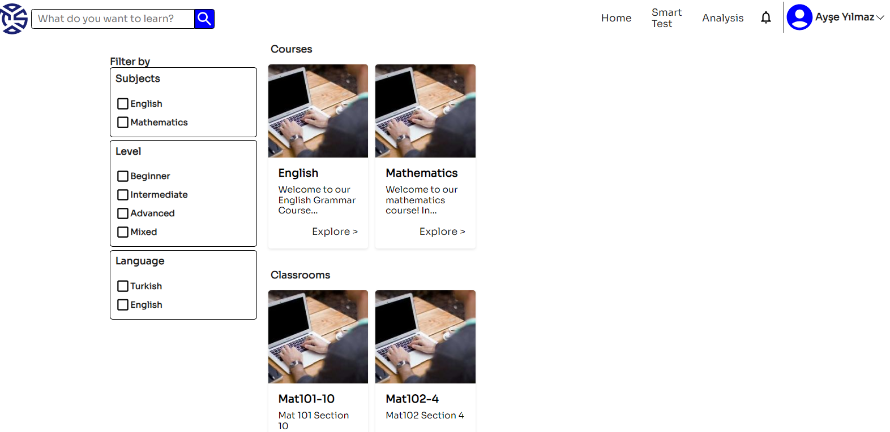
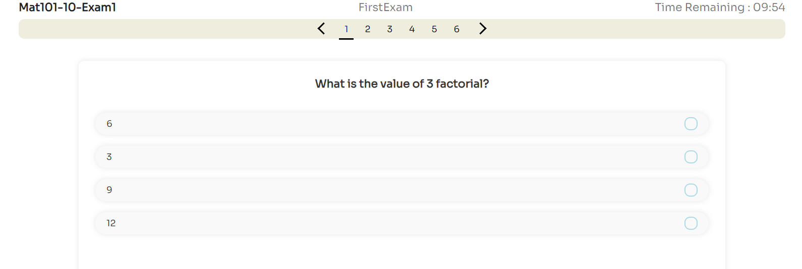

## Personalized Education - TutorSprint 

Below, you can find information on how to run the application.

## Installation and Setup Instructions

The operating system we are testing is Windows 11, the version of Node.js is LTS Version 18.16.0 , Java is 17 , Mysql Community 8.0.33.0 Eclipse is Eclipse IDE 2023‑03.
Please note that Node.js ,Java and Mysql Server must be installed on your computer. 
1. Clone this project.
### Client (React):
1. "Enter the /client/ directory."
Installation:

`npm install`  

To Start Server:

`npm start`  

To Visit App:

`localhost:3000/`

### Server and Database (Springboot and Mysql):
Please note that Java must be installed on your computer.
1. "Open the Eclipse application. Go to File > Import > Existing Maven Project and select /server/pom.xml."
2. Edit the contents of application.properties in the /server/src/main/resources/ directory.
`spring.datasource.url=jdbc:mysql://localhost:3306/tutorsprit
spring.datasource.username=root
spring.datasource.password=Z123abc.`
Change your MySQL server port, username, and password.
3. You can access the backend code in the server\src\main\java\com\tutorSprit\TutorSprit directory. To run the backend, execute TutorSpritApplication.java in this directory.

